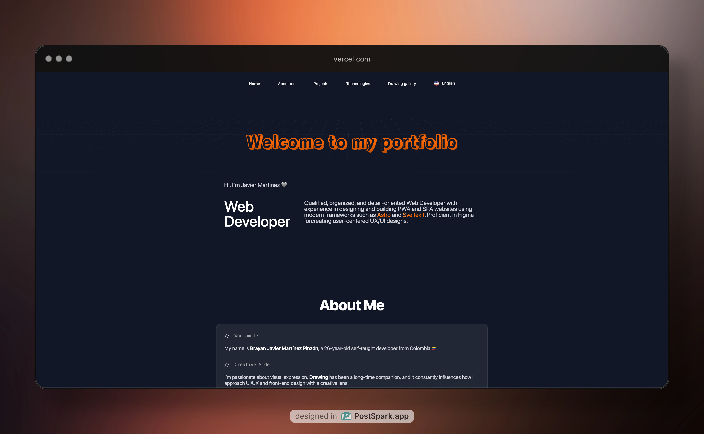
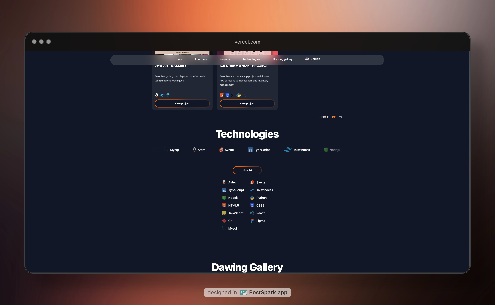
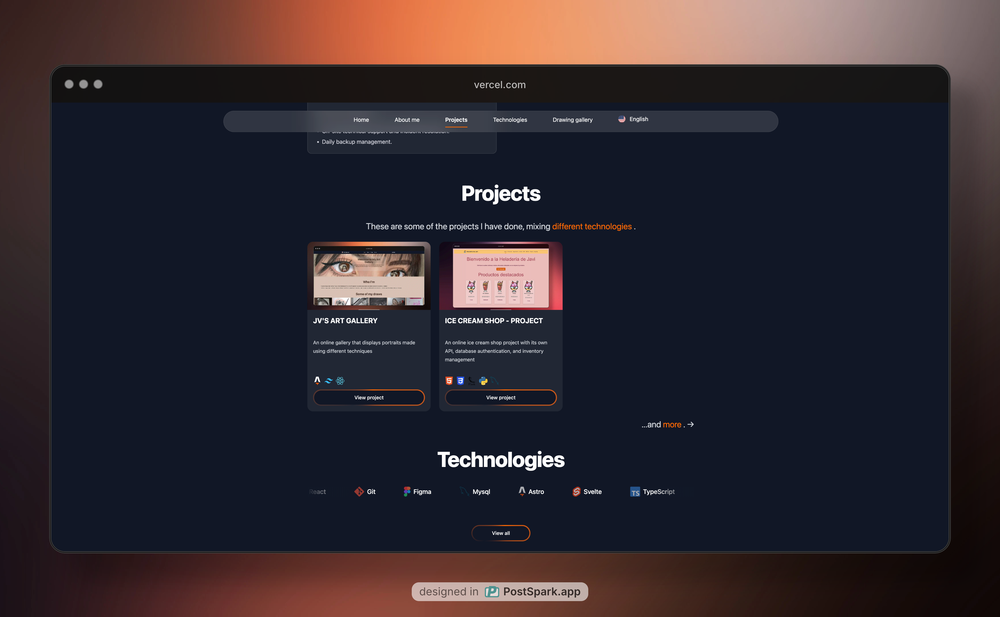
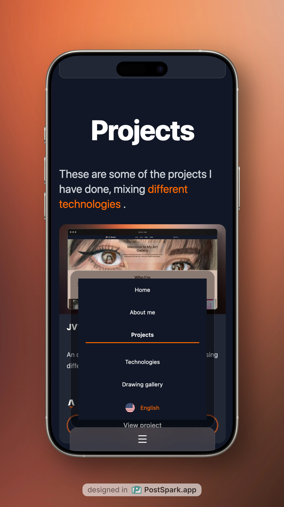

# 🚀 Javi Martínez Portfolio

Welcome to my personal portfolio, built with [Astro](https://astro.build), [Svelte](https://svelte.dev), and [TailwindCSS](https://tailwindcss.com)!  
Showcasing my projects, skills, and experience as a web developer.


---

## ✨ Features

- **Multi-language**: Español, English, Français, Italiano, Português, 한국어
- **Modern stack**: Astro, Svelte, TailwindCSS
- **Responsive Design**: Looks great on all devices
- **Animated Dock Menu**: Svelte-powered social links
- **Smooth Navigation**: Scrollspy, animated nav, and section highlights
- **Technologies Carousel**: Animated, interactive tech showcase
- **Accessible & Fast**: Optimized for performance and accessibility

---

## 📁 Project Structure

```
/
├── public/                # Static assets (images, flags, SVGs)
├── src/
│   ├── assets/            # Project-specific assets
│   ├── components/        # Astro & Svelte UI components
│   ├── data/              # JSON data (about, education, projects)
│   ├── i18n/              # Internationalization utilities & dictionaries
│   ├── layouts/           # Page layouts
│   ├── lib/               # Utility functions
│   ├── pages/             # Astro pages (including dynamic routes. [lang])
│   └── styles/            # Global and component CSS
├── astro.config.mjs       # Astro configuration
├── tailwind.config.ts     # TailwindCSS configuration
├── svelte.config.js       # Svelte integration
└── package.json
```

---

## 🛠️ Getting Started

1. **Install dependencies**

   ```sh
   pnpm install
   ```

2. **Start the development server**

   ```sh
   pnpm dev
   ```

   Visit [localhost:4321](http://localhost:4321) in your browser.

3. **Build for production**

   ```sh
   pnpm build
   ```

4. **Preview the build**
   ```sh
   pnpm preview
   ```

---

## 🌐 Internationalization

This portfolio supports multiple languages.  
Change the language using the picker in the navigation bar.

---

## 📦 Tech Stack

- **Astro** – Static site generator
- **Svelte** – Interactive components
- **TailwindCSS** – Utility-first CSS
- **TypeScript** – Type safety
- **Vercel** – Deployment

---

## 📸 Screenshots

| Home                                 | Technologies                           |
| ------------------------------------ | -------------------------------------- |
|  |  |

| Projects                                     | Movil                                  |
| -------------------------------------------- | -------------------------------------- |
|  |  |

---

## 🤝 Connect

- [GitHub](https://github.com/JvMeraki)
- [LinkedIn](https://www.linkedin.com/in/brayanjmartinezp/)
- [Instagram](https://www.instagram.com/jv_fearnot)

---

> _Created by Brayan Javier Martínez Pinzón_  
> _Built with Astro, Svelte, and TailwindCSS_
